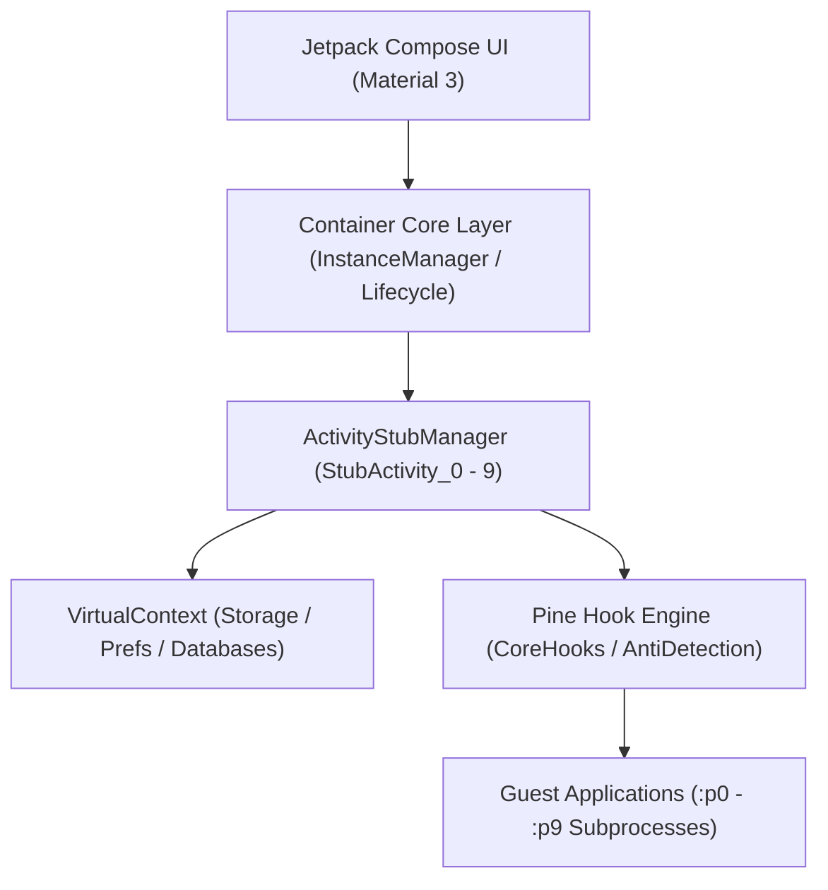

<div align="center">

# 🫙 Renjana

**Modern Android Multi-App Virtual Container with True Sandbox Isolation & Anti-Detection**

[-3DDC84?style=for-the-badge&logo=android&logoColor=white)](https://developer.android.com)
[](https://kotlinlang.org)
[](CHANGELOG.md)
[](LICENSE)

<p align="center">
  <b>Run unlimited parallel instances & multiple apps per container with isolated filesystem, accounts, and anti-detection — no root required.</b>
</p>

</div>

---

## 📖 Overview

**Renjana** is a high-performance Android virtual container engineered to clone, sandbox, and run multiple applications simultaneously. Each instance container operates with fully isolated storage directories, independent Google accounts, unique hardware fingerprints, and dedicated subprocess stacks (`:p0` – `:p9`), without requiring device root or system modifications.

> [!NOTE]
> Powered by the **Pine** dynamic instrumentation framework and **AndroidX Jetpack Compose Material 3** design system.

---

## ✨ Key Features

| Feature | Description |
| :--- | :--- |
| 🗂️ **Multi-Instance Containers** | Clone any installed application or APK into independent, isolated virtual containers. |
| 📦 **Multi-App Per Container** | Host and launch multiple distinct applications inside a single container instance. |
| 🔑 **Independent Google Accounts** | Assign and virtualize different Google accounts per container instance. |
| 🔒 **True Sandbox Data Isolation** | Dedicated `/instances/<id>/packages/<package>/` paths for databases, shared prefs, cache, and DEX cache. |
| 🧩 **Split APK (App Bundle) Support** | Seamless dynamic loading for modern Google Play multi-split APK architectures. |
| 🛡️ **Anti-Detection & Fingerprint Spoofing** | Randomize Android ID, IMEI, Build props, signature spoofing, and evasion checks. |
| 🌱 **Non-Root Operation** | Full user-space virtualization using lightweight ART runtime instrumentation. |

---

## 🗺️ Roadmap & Milestones

| Milestone / Capability | Status | Target |
| :--- | :---: | :---: |
| 📦 Multi-App per Container Instance | ✅ **Completed** | `v0.2.0` |
| 🧩 Split APK (App Bundle) Loading | ✅ **Completed** | `v0.2.0` |
| 🔒 Per-App Storage Sandboxing | ✅ **Completed** | `v0.2.0` |
| 🛡️ GMS & Firebase Client Isolation | ✅ **Completed** | `v0.2.0` |
| 📱 Hardware Fingerprint Spoofing | ✅ **Completed** | `v0.2.0` |
| ✍️ Package Signature Spoofing | ✅ **Completed** | `v0.2.0` |
| 🔌 Xposed Framework Support (Root) | 🔄 *In Planning* | `v0.3.0` |

---

## 🏗️ Architecture



---

## 📋 System Requirements

- **Operating System:** Android 10.0+ (API Level 29+)
- **Architecture:** `arm64-v8a`, `armeabi-v7a`
- **Build Toolchain:** JDK 17, Android Gradle Plugin 8.1.0+, Kotlin 1.9.20

---

## 🛠️ Build & Installation

### Prerequisites
Clone the repository and ensure Android SDK platform tools are configured in your environment:

```bash
# Clone repository
git clone https://github.com/fesu/renjana.git
cd renjana

# Debug Build
./gradlew assembleDebug

# Release Build (Requires Keystore)
./gradlew assembleRelease
```

---

## 🚀 Quick Start Guide

1. **Install APK**: Install `app-arm64-v8a-release.apk` on your target Android device.
2. **Grant Permissions**: Launch Renjana and grant required overlay and storage permissions.
3. **Add Accounts**: (Optional) Navigate to **Accounts** tab and link a Google Account for GMS virtualization.
4. **Create Container**: Tap **+** on the Home screen, select target apps to clone, configure spoofing options, and tap **Create**.
5. **Launch & Enjoy**: Tap **▶ Play** to run your virtual instance.

---

## 📚 Documentation Index

Detailed module guides are available in the [`docs/`](docs/README.md) directory:

- [🏠 Home Screen Guide](docs/HOME.md) — Container overview, status cards, and quick actions.
- [📱 Apps Catalog](docs/APPS.md) — APK scanning and cloning interface.
- [✨ Create Instance Wizard](docs/CREATE_INSTANCE.md) — Container configuration and spoof presets.
- [⚙️ Instance Detail Screen](docs/INSTANCE_DETAIL.md) — Multi-app launcher, runtime controls, and device config.
- [🔍 Diagnostics & Hardware](docs/DIAGNOSTICS.md) — Live spoofing verification and hook telemetry.
- [👤 Accounts Management](docs/ACCOUNTS.md) — Google Sign-In virtualization.
- [🛠️ Error Logs](docs/ERROR_LOG.md) — In-app crash logging and runtime diagnostics.
- [🐛 Problem & Post-Mortem Log](PROBLEM.md) — Detailed technical log of 9 resolved virtualization challenges.

---

## 💻 Tech Stack

| Layer | Component | Version |
| :--- | :--- | :--- |
| **Language** | Kotlin | `1.9.20` |
| **UI Toolkit** | Jetpack Compose BOM | `2023.10.01` |
| **Local Database** | Room DB | `2.6.0` |
| **Concurrency** | KotlinX Coroutines | `1.7.3` |
| **Hook Engine** | Pine Framework | `0.3.0` |
| **Xposed Bridge** | Pine Xposed Layer | `0.2.0` |
| **Navigation** | AndroidX Navigation Compose | `2.7.4` |

---

## 🤝 Contributing

Contributions, bug reports, and feature proposals are welcome! Please check our [Contributing Guidelines](CONTRIBUTING.md) before submitting pull requests.

---

## ⚖️ License

Distributed under the **Apache License 2.0**. See [`LICENSE`](LICENSE) for more details.

> [!WARNING]
> *Disclaimer: Renjana is developed for educational, testing, and research purposes. Please ensure compliance with terms of service of any third-party applications virtualized.*


