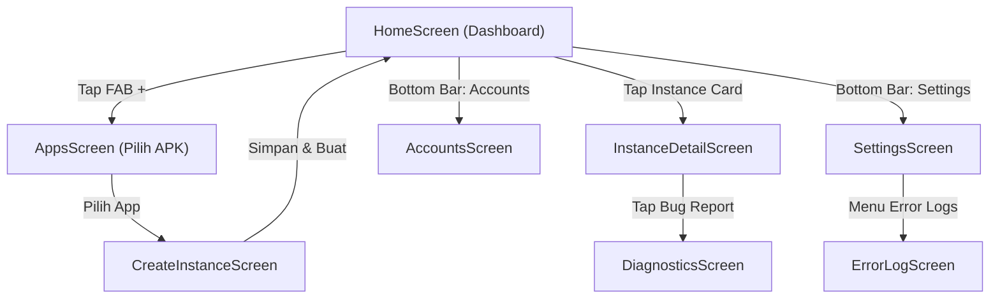

# 📚 Dokumentasi Panduan Antarmuka Renjana

Dokumentasi komprehensif mengenai tata letak, fungsi, alur interaksi, dan kontrol teknis untuk setiap layar di dalam aplikasi Renjana Container.

---

## 📑 Indeks Layar

| Layar | Panduan | Deskripsi Fitur |
| :--- | :--- | :--- |
| **🏠 Home** | [`HOME.md`](HOME.md) | Dashboard daftar seluruh instance virtual & monitoring status live |
| **📱 Apps** | [`APPS.md`](APPS.md) | Katalog aplikasi terpasang di perangkat untuk di-clone |
| **✨ Create Instance** | [`CREATE_INSTANCE.md`](CREATE_INSTANCE.md) | Wizard pembuatan container baru & konfigurasi awal spoofing |
| **⚙️ Instance Detail** | [`INSTANCE_DETAIL.md`](INSTANCE_DETAIL.md) | Manajemen multi-app, kontrol status, tab device, dan direct actions |
| **🔍 Diagnostics** | [`DIAGNOSTICS.md`](DIAGNOSTICS.md) | Inspeksi hardware spoofing real-time vs spoofed properties |
| **👤 Accounts** | [`ACCOUNTS.md`](ACCOUNTS.md) | Manajemen multi-akun Google dan integrasi GMS sandbox |
| **🛠️ Settings** | [`SETTINGS.md`](SETTINGS.md) | Preferensi tema, pengaturan performa container, dan data storage |
| **🪵 Error Log** | [`ERROR_LOG.md`](ERROR_LOG.md) | Viewer log runtime, crash interceptor, dan diagnosis virtualisasi |

---

## 🗺️ Diagram Alur Navigasi

